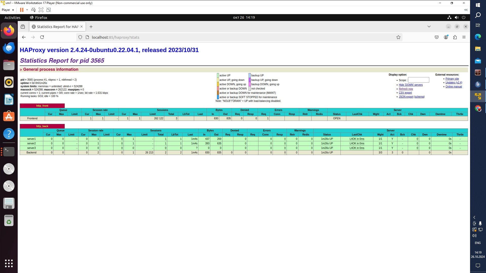

# Задание 1
Запустите два simple python сервера на своей виртуальной машине на разных портах
Установите и настройте HAProxy, воспользуйтесь материалами к лекции по ссылке
Настройте балансировку Round-robin на 4 уровне.
На проверку направьте конфигурационный файл haproxy, скриншоты, где видно перенаправление запросов на разные серверы при обращении к HAProxy.
***
### Конфиг haproxy.

  frontend http_front
       bind *:85
       stats uri /haproxy?stats
       default_backend http_back

   backend http_back
       balance roundrobin
       server server1 127.0.0.1:8888 check
       server server2 127.0.0.1:9999 check
       server server3 127.0.0.1:7777 check

# Задание 2
